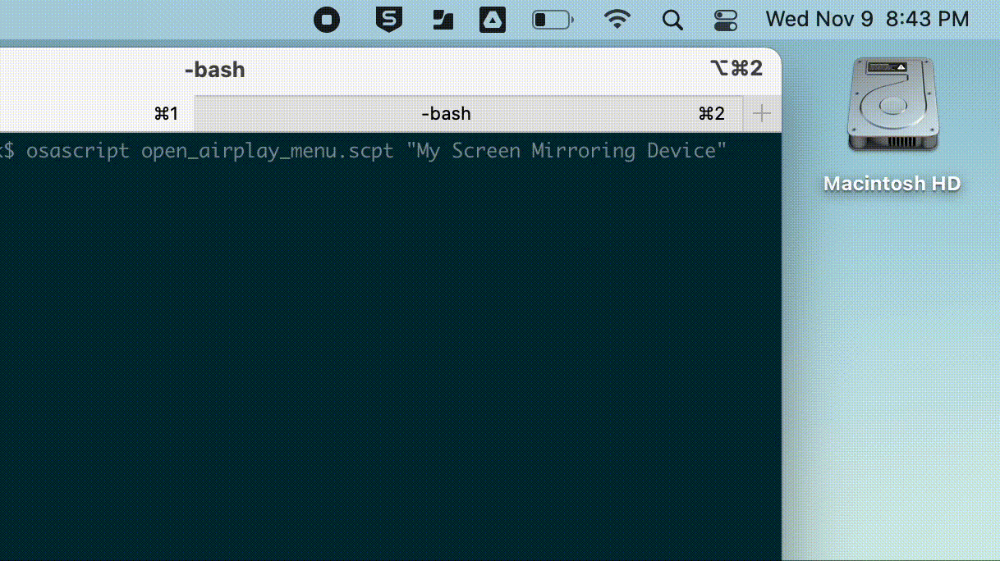

# Auto Open Screen Mirroring #
AppleScript to open the "Screen Mirroring" dropdown. 
It will work if the icon has been dragged on to the menubar or if it's still under the "Control Center" dropdown menu.
The script accepts an optional commandline argument if you want to connect to a specified device in the Screen Mirroring dropdown.

## Usage ## 
Open the "open_airplay_menu.applescript" in the built-in Script Editor and either run or compile.
You could also use the already compiled applescript file from this repository "open_airplay_menu.scpt"

~

From terminal run ``osascript open_airplay_menu.scpt``

which will just open the Screen Mirroring dropdown. 

OR

Run ``osascript open_airplay_menu.scpt "example Device Name"``

which will open the Screen Mirroring dropdown and select the passed device name. 

### Some Details ###
Opening the Screen Mirroring menu using AppleScript is fairly straight forward if it is already in the menubar. 
If the Screen Mirroring item hasn't been moved to the menubar it'll be under the Control Center dropdown and it changes how it is interacted with.

Even though the Screen Mirroring item in the Control Center dropdown is still a "checkbox" a click event doesn't work on it like it does from the menubar. 
The Screen Mirroring checkbox here instead has an "action 2" or "action 1" that needs to be used to perform the "click" action. 

### Notes ###
You may need to give both **osascript** and your **terminal app** "Acessibility" access under "Security and Privacy" in "System Preferences"
Script should now be able to handle different languages. 

Only partially tested on Ventura. 

#### Tested ####
MacOS: 11.1,12.0.1,12.6,13.0.1
